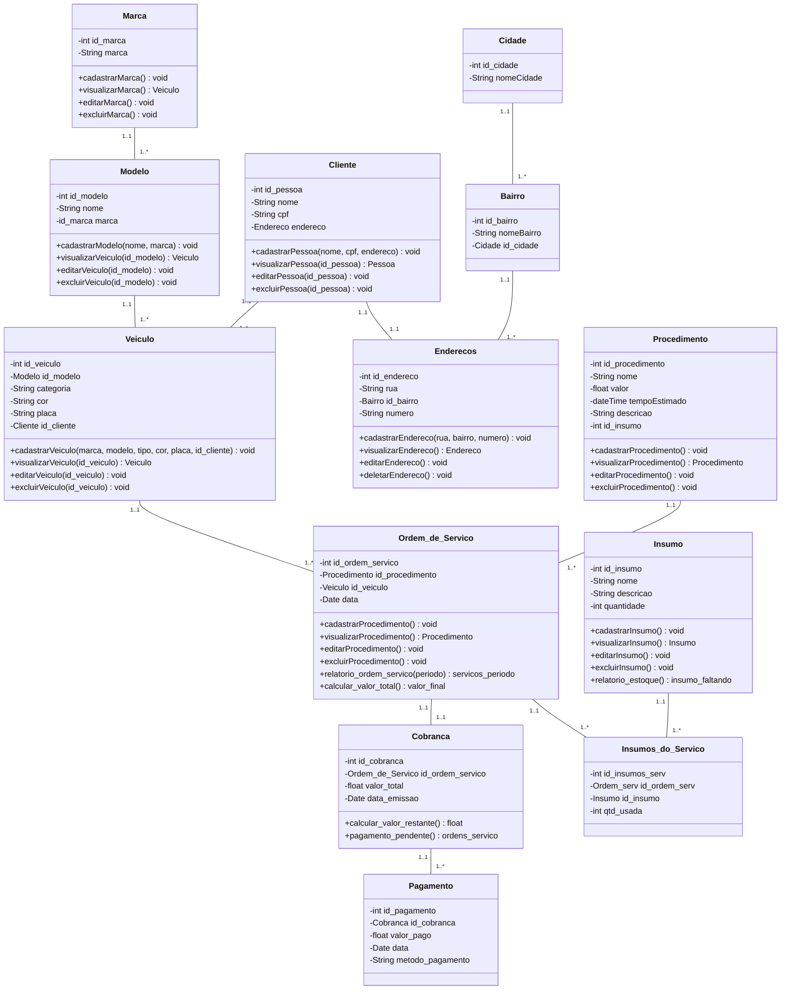
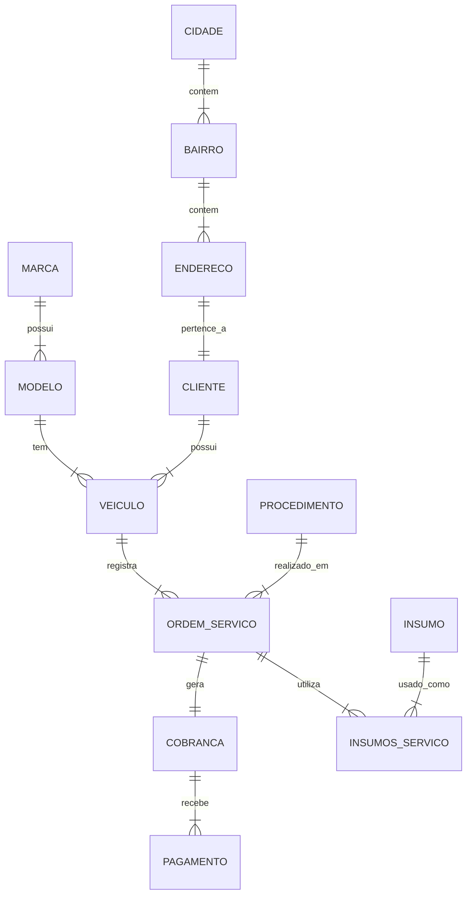

# Documento de Modelos

## Modelo Conceitual

### Diagrama de Classes usando Mermaid

### Descrição das Entidades

Descrição sucinta das entidades presentes no sistema.

| Entidade | Descrição   |
|----------|------------------------------------------------------------------------------------------------------------------------------------------------------|
| Cliente   | Entidade para representar os clientes da loja tendo as informações de: nome, telefone e *endereco*.                                                  |
| Veiculo   | Entidade que representa um veiculo de determinado cliente tem as informações: *Modelo*, categoria, cor, placa, *cliente*. |
| Procedimentos   | Entidade que representa um Procedimento/Serviço que a oficina com as informações: nome, valor, tempoEstimado, descrição. |
| Ordem de Serviços | Entidade que representa uma Ordem de serviço onde se relacionam um veiculo de um cliente a um procedimento que foi realizado nele com as informações: *procedimento*, *veiculo*, data. |
| Insumo | Entidade que representa um Insumo presente no estoque da Oficina com as informações: nome, descricao, quantidade.  |

## Modelo de Dados (Entidade-Relacionamento)

Para criar modelos ER é possível usar o BrModelo e gerar uma imagem. Contudo, atualmente é possível criar modelos ER usando a ferramenta **Mermaid**, escrevendo o modelo diretamente em markdown. Acesse a documentação para escrever modelos [ER Diagram Mermaid](https://mermaid-js.github.io/mermaid/#/entityRelationshipDiagram).

### Dicionário de Dados

| Tabela     | Cliente |
| ---------- | ------- |
| Descrição  | Armazena as informações pessoais e de contato dos clientes da oficina. |
| Observação | Cada cliente pode possuir um ou mais veículos associados a ele. |

| Nome          | Descrição                        | Tipo de Dado | Tamanho | Restrições de Domínio |
| ------------- | -------------------------------- | ------------ | ------- | --------------------- |
| id_pessoa     | identificador gerado pelo SGBD   | SERIAL       | ---     | PK / Identity |
| nome          | nome completo do cliente         | VARCHAR      | 150     | Not Null |
| cpf           | documento de identificação       | VARCHAR      | 14      | Unique / Not Null |
| id_endereco   | referência ao endereço do cliente| SERIAL       | ---     | FK / Not Null |

| Tabela     | Veiculo |
| ---------- | ------- |
| Descrição  | Armazena os dados dos veículos cadastrados para manutenção na oficina. |
| Observação | O veículo obrigatoriamente pertence a um cliente e é de um modelo específico. |

| Nome          | Descrição                        | Tipo de Dado | Tamanho | Restrições de Domínio |
| ------------- | -------------------------------- | ------------ | ------- | --------------------- |
| id_veiculo    | identificador gerado pelo SGBD   | SERIAL       | ---     | PK / Identity |
| categoria     | categoria do veículo (ex: SUV)   | VARCHAR      | 50      | Not Null |
| cor           | cor predominante do veículo      | VARCHAR      | 30      | Not Null |
| placa         | placa de identificação           | VARCHAR      | 10      | Unique / Not Null |
| id_modelo     | referência ao modelo do veículo  | SERIAL       | ---     | FK / Not Null |
| id_cliente    | referência ao dono do veículo    | SERIAL       | ---     | FK / Not Null |

| Tabela     | Ordem_Servico |
| ---------- | ------------- |
| Descrição  | Registra os serviços que estão sendo ou foram realizados na oficina. |
| Observação | Entidade central que conecta o veículo aos procedimentos e peças (insumos). |

| Nome              | Descrição                        | Tipo de Dado | Tamanho | Restrições de Domínio |
| ----------------- | -------------------------------- | ------------ | ------- | --------------------- |
| id_ordem_servico  | identificador gerado pelo SGBD   | SERIAL       | ---     | PK / Identity |
| data              | data de abertura do serviço      | DATE         | ---     | Not Null |
| id_procedimento   | referência ao procedimento       | SERIAL       | ---     | FK / Not Null |
| id_veiculo        | referência ao veículo consertado | SERIAL       | ---     | FK / Not Null |

| Tabela     | Procedimento |
| ---------- | ------------ |
| Descrição  | Catálogo de serviços e mão de obra oferecidos pela oficina. |
| Observação | Define o que é feito, tempo estimado e quanto custa a mão de obra. |

| Nome              | Descrição                        | Tipo de Dado | Tamanho | Restrições de Domínio |
| ----------------- | -------------------------------- | ------------ | ------- | --------------------- |
| id_procedimento   | identificador gerado pelo SGBD   | SERIAL       | ---     | PK / Identity |
| nome              | nome do serviço oferecido        | VARCHAR      | 100     | Not Null |
| valor             | valor cobrado pela mão de obra   | NUMERIC      | 10,2    | Not Null |
| tempoEstimado     | tempo estimado para conclusão    | TIMESTAMP    | ---     | Not Null |
| descricao         | detalhamento técnico do serviço  | VARCHAR      | 250     | --- |
| id_insumo         | referência a um insumo padrão    | SERIAL       | ---     | FK |

| Tabela     | Insumo |
| ---------- | ------ |
| Descrição  | Estoque de peças e materiais utilizados nos serviços da oficina. |
| Observação | Pode representar desde peças grandes até consumíveis (óleo, estopa). |

| Nome              | Descrição                        | Tipo de Dado | Tamanho | Restrições de Domínio |
| ----------------- | -------------------------------- | ------------ | ------- | --------------------- |
| id_insumo         | identificador gerado pelo SGBD   | SERIAL       | ---     | PK / Identity |
| nome              | nome da peça ou material         | VARCHAR      | 100     | Not Null |
| descricao         | especificações técnicas e marca  | VARCHAR      | 250     | --- |
| quantidade        | quantidade atual em estoque      | INTEGER      | ---     | Not Null |
