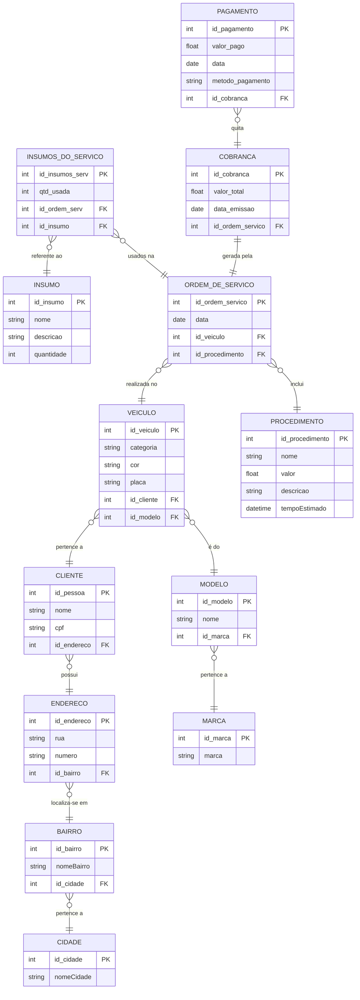

# Documento de Visão

## Descrição do Projeto

O projeto consiste no desenvolvimento de um sistema de gestão para automatizar e organizar os principais processos do dia a dia de uma oficina mecânica de pequeno porte. O sistema permitirá o cadastro completo de clientes, veículos e serviços, possibilitando o acompanhamento do histórico de atendimentos e facilitando o relacionamento com os clientes. Além disso, contará com um controle de estoque eficiente que registrará a entrada e saída de peças, controle financeiro (registro de receitas, despesas e pagamentos) e a padronização dos valores de cada procedimento realizado na oficina.

## Equipe e Definição de Papéis

| Membro | Papel |
| :--- | :--- |
| Ariadny Francisca Dantas Santos | Analista e Desenvolvedora |
| João Roberto Galvão Aquino | Analista e Desenvolvedor |
| José Salustiano Neto Junior | Analista e Desenvolvedor |
| Riam Stefesom Venâncio da Silva | Analista e Desenvolvedor |

### Matriz de Competências

| Membro | Competências |
| :--- | :--- |
| Ariadny Francisca Dantas Santos | Desenvolvedora com experiência nas tecnologias adotadas para o projeto |
| João Roberto Galvão Aquino | Desenvolvedor com experiência nas tecnologias adotadas para o projeto |
| José Salustiano Neto Junior | Desenvolvedor com experiência nas tecnologias adotadas para o projeto |
| Riam Stefesom Venâncio da Silva | Desenvolvedor com experiência nas tecnologias adotadas para o projeto |

## Perfis dos Usuários

A avaliação do cenário identificou que a oficina conta com apenas dois funcionários (o gerente e um auxiliar, que é seu filho). Dessa forma, não se faz necessário que haja no sistema vários atores, mas apenas um.

| Perfil | Descrição |
| :--- | :--- |
| **Administrador** | Possui todas as permissões do sistema de cadastrar, editar, atualizar e consultar qualquer tabela e será utilizado tanto pelo gerente como também pelo seu auxiliar. |

---

## Lista de Requisitos Funcionais

### Entidade Cliente - RF01 - Manter Clientes
Registrar clientes no sistema com suas informações principais.

| Requisito | Descrição | Ator |
| :--- | :--- | :--- |
| RF01.01 - Inserir Cliente | Preencher informações do cliente: Nome, CPF, Data de Nascimento, Endereço e Telefone. | Administrador |
| RF01.02 - Ler Cliente | Solicita e apresenta as informações do Cliente cadastradas no sistema. | Administrador |
| RF01.03 - Atualizar Cliente | Consulta e envia novos dados para alteração do cadastro do cliente. | Administrador |
| RF01.04 - Deletar Cliente | Solicita suspender/desativar o cadastro do cliente no sistema. | Administrador |

---

### Entidade Veículo - RF02 - Manter Veículos
Registrar veículos vinculados sempre a algum cliente, com outras informações relevantes.

| Requisito | Descrição | Ator |
| :--- | :--- | :--- |
| RF02.01 - Inserir Veículo | Preencher dados do veículo: Marca, Modelo, Tipo, Cor, Placa. | Administrador |
| RF02.02 - Ler Veículo | Solicita e apresenta as informações do veículo cadastradas no sistema. | Administrador |
| RF02.03 - Atualizar Veículo | Insere as novas informações do veículo e solicita atualização. | Administrador |
| RF02.04 - Deletar Veículo | Solicita deletar e desativa o cadastro de determinado veículo no sistema. | Administrador |

---

### Entidade Procedimento - RF03 - Manter Procedimentos (Serviços)
Cadastrar todos ou os mais recorrentes serviços realizados na oficina.

| Requisito | Descrição | Ator |
| :--- | :--- | :--- |
| RF03.01 - Inserir Procedimento | Preencher informações: Nome, valor, tempo médio para realização e descrição. | Administrador |
| RF03.02 - Ler Procedimento | Solicita e apresenta as informações do procedimento cadastradas no sistema. | Administrador |
| RF03.03 - Atualizar Procedimento | Envia os dados para alteração do procedimento. | Administrador |
| RF03.04 - Deletar Procedimento | Solicita suspender e desativa o cadastro do procedimento no sistema. | Administrador |

---

### Entidade Ordem de Serviço - RF04 - Manter Ordens de Serviços
Cadastrar todos os serviços realizados na oficina atrelando ao carro ao qual foi prestado esse serviço.

| Requisito | Descrição | Ator |
| :--- | :--- | :--- |
| RF04.01 - Inserir Ordem | Preencher informações: ID do veículo vinculado, ID do procedimento realizado e data de chegada. | Administrador |
| RF04.02 - Ler Ordem | Solicita e apresenta as informações da ordem de serviço cadastradas no sistema. | Administrador |
| RF04.03 - Atualizar Ordem | Envia os dados para alteração da ordem de serviço. | Administrador |
| RF04.04 - Deletar Ordem | Solicita deletar e desativa a ordem de serviço no sistema. | Administrador |

---

### Entidade Insumos - RF06 - Manter Insumos
Cadastro de insumos de alta demanda, como peças usadas nas reparações.

| Requisito | Descrição | Ator |
| :--- | :--- | :--- |
| RF06.01 - Inserir Insumo | Preencher informações do item: Nome, Marca, Descrição. | Administrador |
| RF06.02 - Ler Insumo | Solicita e apresenta informações de determinado item cadastrado no estoque. | Administrador |
| RF06.03 - Atualizar Insumo | Insere as novas informações do item e solicita atualização. | Administrador |
| RF06.04 - Deletar Insumo | Solicita deletar e remove os dados do item do banco de dados. | Administrador |

---

### Pagamentos e Relatórios

| Requisito | Descrição | Ator |
| :--- | :--- | :--- |
| RF05 - Registrar Pagamentos | Informar qual a Ordem de Serviço para gerar/registrar o pagamento feito pelo cliente. | Administrador |
| RF07.01 - Relatório de Serviços | Exibe os serviços feitos durante um período informado. | Administrador |
| RF07.02 - Relatório de Inadimplentes | Filtra e exibe clientes com pagamentos pendentes atrelados a ordens de serviço. | Administrador |
| RF07.03 - Relatório de Estoque | Mostra o relatório de insumos que estão em falta ou com quantidade baixa no estoque. | Administrador |

---

## Modelo Conceitual

Abaixo apresentamos o modelo conceitual usando **Mermaid**, extraído integralmente do Diagrama de Classes do Plano de Automação.

---

## Lista de Requisitos Não-Funcionais

| Requisito | Descrição |
| :--- | :--- |
| **RNF01 - Acessibilidade** | O sistema deve possuir uma interface simples e intuitiva, adequada para usuários com pouca familiaridade com tecnologia. |
| **RNF02 - Segurança** | Os dados de clientes, veículos e transações devem ser protegidos por autenticação e criptografia. |
| **RNF03 - Backup e Recuperação** | O sistema deve realizar backups automáticos periódicos e permitir recuperação de dados em caso de falha. |
| **RNF04 - Desempenho** | O sistema deve garantir respostas rápidas em operações básicas (cadastro, consulta, registro de serviço) mesmo com o crescimento da base de dados. |
| **RNF05 - Suporte Técnico** | O sistema deve contar com suporte técnico para resolução de falhas ou dúvidas dos usuários. |

---

## Riscos

Tabela com o mapeamento dos riscos do projeto, as possíveis soluções e os responsáveis.

| Data | Risco | Prioridade | Responsável | Status | Providência/Solução |
| ------ | ------ | ------ | ------ | ------ | ------ |
| 10/03/2025 | Não aprendizado das ferramentas utilizadas pelos componentes do grupo | Alta | Todos | Vigente | Reforçar estudos sobre as ferramentas e realizar reuniões de alinhamento técnico |
| 10/03/2025 | Ausência por qualquer motivo do cliente para validação de requisitos | Média | Gerente | Vigente | Planejar o cronograma tendo em base a agenda da oficina |
| 10/03/2025 | Divisão de tarefas mal sucedida | Baixa | Gerente | Vigente | Acompanhar de perto o desenvolvimento de cada membro da equipe |
| 10/03/2025 | Dificuldade em integrar tabelas de serviço e estoque (insumos) | Alto | Todos | Resolvido | Criar modelagem de banco de dados sólida antes de iniciar o código |

### Referências

* Documento de Visão Original do Projeto.
* Plano de Automação - Oficina Mecânica (Ariadny, João, José e Riam).
